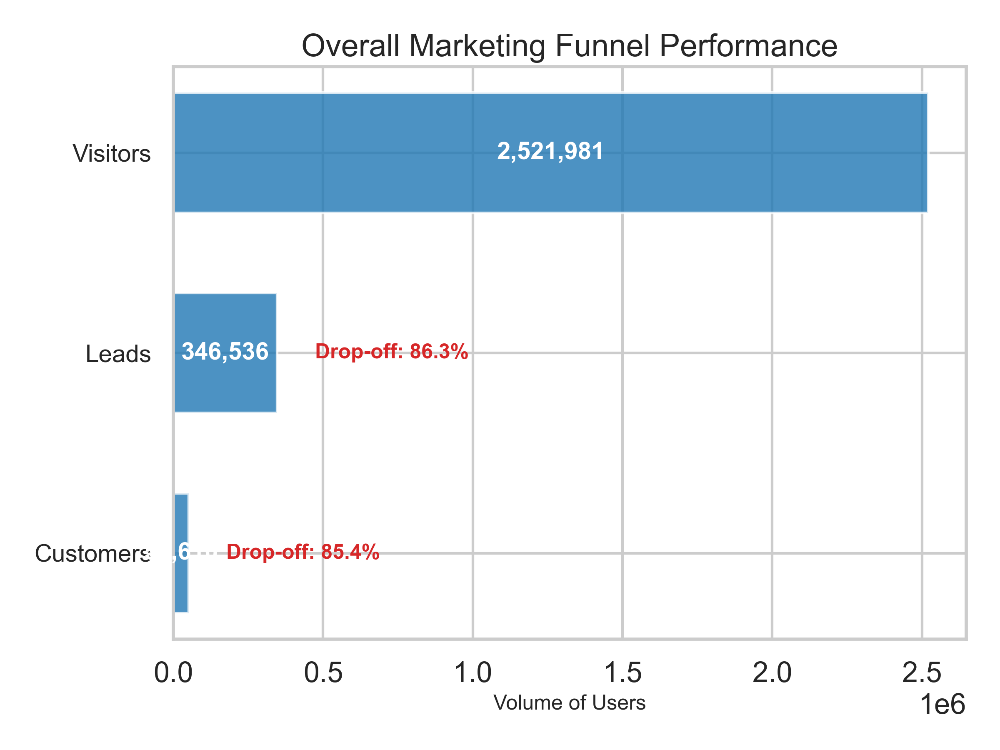
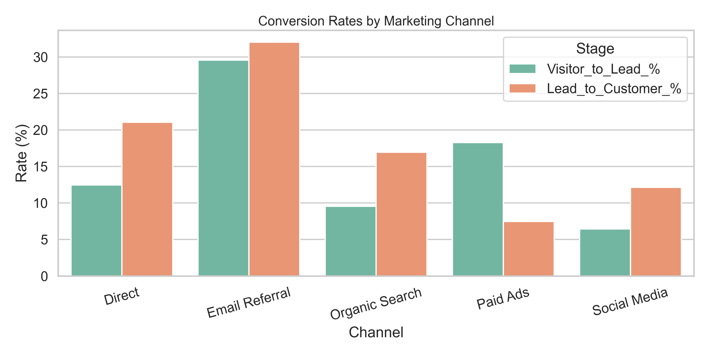
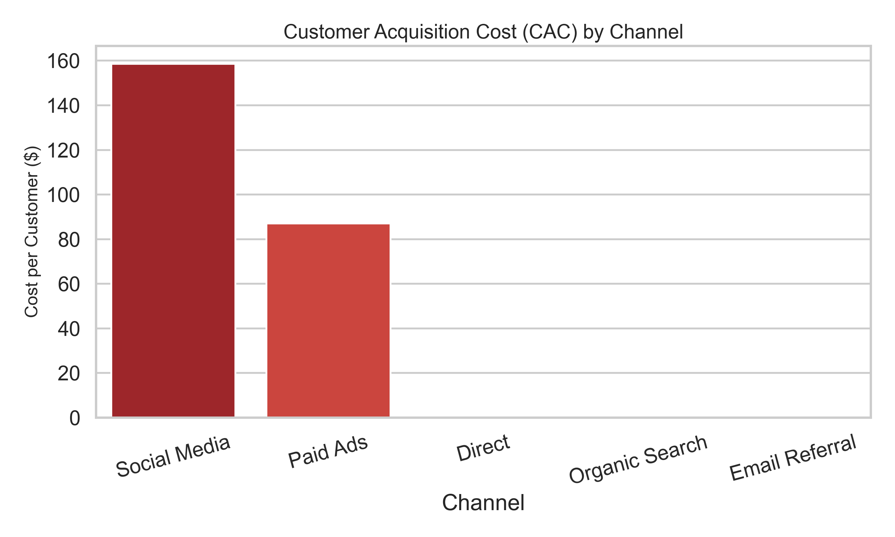
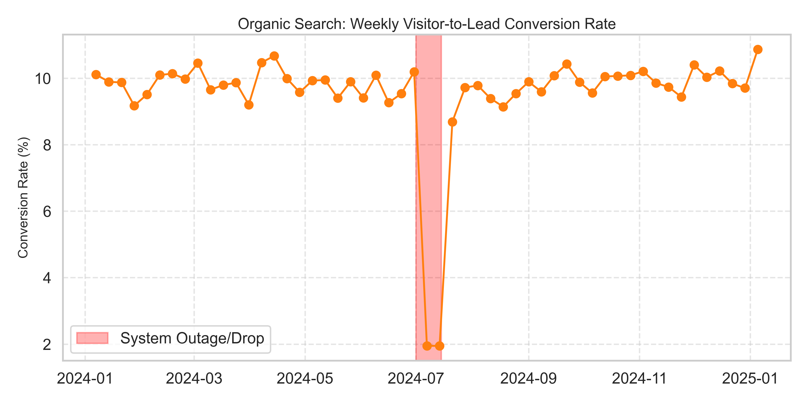

# 🎯 Marketing Funnel & Conversion Performance Report

## Executive Summary
This analysis evaluates the end-to-end customer journey from website visitor to paying customer across multiple marketing channels. By analyzing drop-off points and channel-specific conversion rates, we can optimize ad spend and identify technical bottlenecks in the sales funnel.

### High-Level Funnel Metrics
- **Overall Visitor-to-Lead Rate:** 13.7%
- **Overall Lead-to-Customer Rate:** 14.6%
- **Highest Converting Channel:** Email Referral
- **Highest Traffic Channel:** Paid Ads

---

## 1. The Macro Funnel Drop-Off

**Insight:** 
The largest drop-off occurs between the Visitor and Lead stages. Over 80% of users leave the site without providing contact information or signing up. Once a user becomes a Lead, the sales conversion process is relatively healthy.

**Recommendation:** 
- **Top-of-Funnel Focus:** Optimize landing pages using A/B testing on call-to-action (CTA) buttons, reduce the number of form fields, and implement exit-intent popups to capture more leads before they bounce.

---

## 2. Channel Conversion Efficiency

**Insight:** 
While **Paid Ads** drives the most traffic, **Email Referral** converts at the highest percentage. Social Media traffic has a notoriously low visitor-to-lead conversion rate, indicating that the traffic might be low intent or mismatched with the landing page offering.

**Recommendation:** 
- **Reallocate Budget:** Shift marketing spend away from low-converting Social Media campaigns and double down on Email Referral outreach.
- **Message Matching:** Ensure the ad copy on Social Media strictly aligns with the landing page to improve intent and reduce immediate bounce rates.

---

## 3. Customer Acquisition Cost (CAC)

**Insight:** 
Paid Ads have the highest CAC by a massive margin. While they bring in volume, the cost to convert those leads into customers is heavily cutting into profit margins. Email Referral and Organic Search are highly cost-efficient.

**Recommendation:** 
- **Optimize Bidding:** Review Paid Ads keywords and pause underperforming campaigns. Focus on long-tail, high-intent keywords to lower CPC and improve the Lead-to-Customer rate.

---

## 4. Time-Series Drop-Offs (Anomaly Detection)

**Insight:** 
Tracking the Organic Search visitor-to-lead rate over time reveals a sharp drop mid-July (highlighted in red). Traffic remained steady, but leads plummeted, indicating a broken form, a server-side error, or a broken tracking pixel during that specific window.

**Recommendation:** 
- **Alert Systems:** Implement automated anomaly detection alerts. If conversion rates drop by more than 15% WoW on a stable channel, engineering and marketing should be notified immediately to investigate site health.

---

## Conclusion
The data clearly shows that **quality beats quantity** in the marketing funnel. Future growth should focus on optimizing the conversion mechanics for the high-volume Paid Ads channel, while scaling investments in the highly efficient Email Referral channel. Fixing the top-of-funnel (Visitor to Lead) drop-off is the single highest leverage point for increasing revenue.
